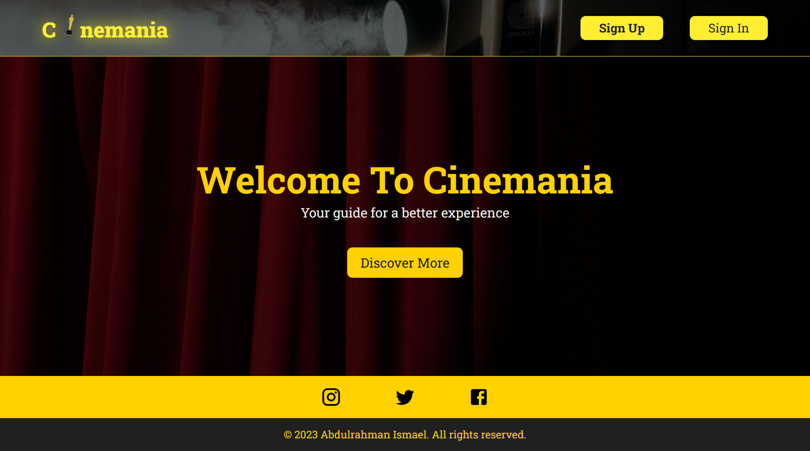
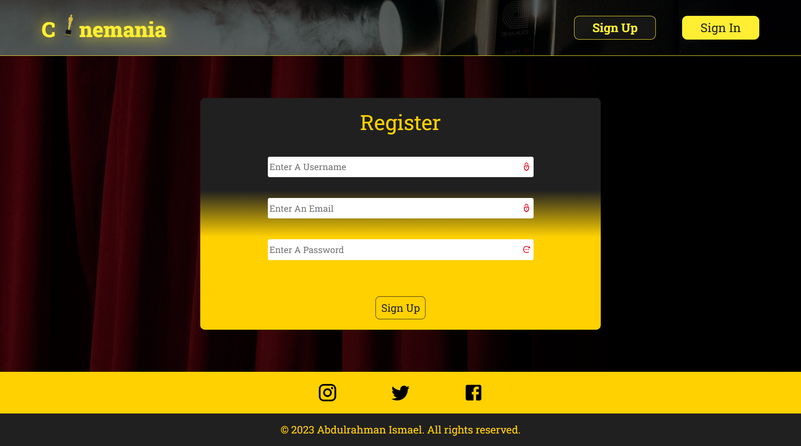
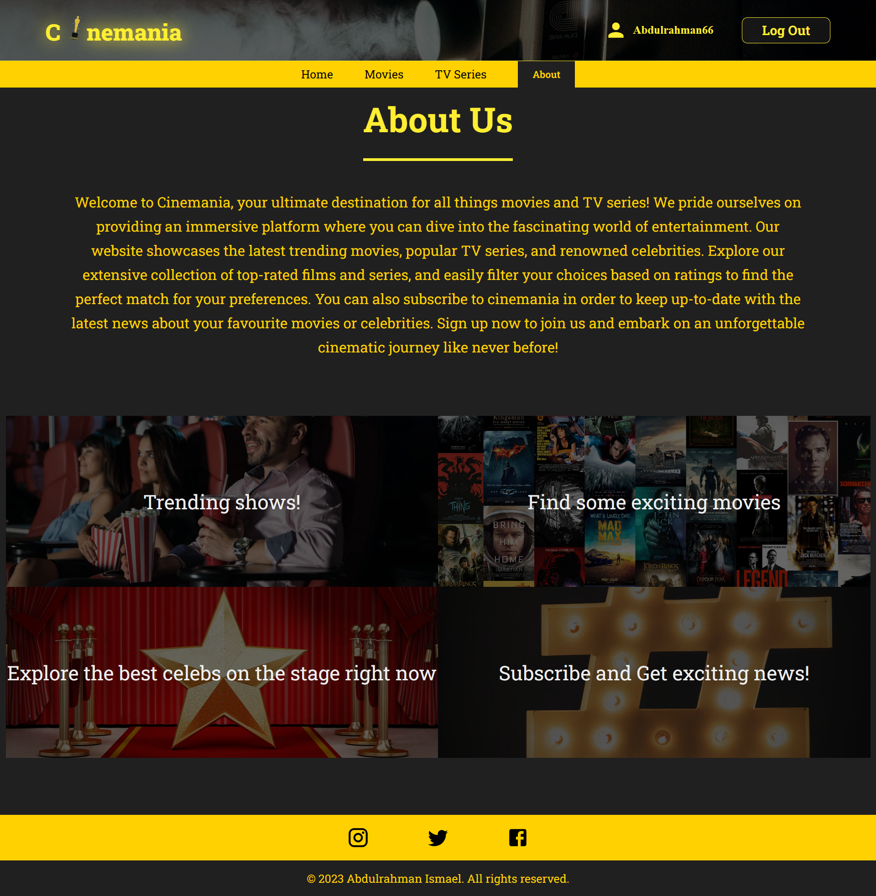

# Cinemania

Discover a seamless movie and TV series experience on our website. Built with React and optimized tools, **stay up-to-date with the latest releases and immerse yourself in the world of cinema**. Enjoy a responsive user interface for effortless browsing on any device.

# My Pre-Planning of The Project

# Features

Cinemania comes with a wide range of powerful features that will serve movies fans. Some of the notable features include:

- Keeping Up to date with hollywood movies.
- Exploring the best shows and the best actors
- Easy-to-use website with flexible transitions and enjoyable usage
- Filtering shows on your own choices
- Subscribing to get the latest news about the cinema world

## Tools

- React
- React Router
- React Query
- Sass (CSS)
- JavaScript
- material ui icons

## Screenshots

Cinemania

Sign In

Register

Home

Movies

Series

About

---

## 🚀 About Me

Junior Front-end developer with a history of creating engaging, user-friendly websites with proven success. Developed modern websites with advanced features, showcasing technical excellence. Motivated to stay up-to-date with industry trends and best practices. Aspiring to be a Full-stack developer with a strong determination and passion for coding.

## 🛠 Skills

- HTML - HTML5
- CSS - CSS3
- JavaScript
- Object Oriented Programming (OOP)
- Sass\SCSS
- Pug
- GulpJs
- BootStrap
- Material UI
- React.js
- React ecosystems (React Router - React Redux - React Query)
- Redux - Redux Toolkit
- Firebase

## 🔗 Links

